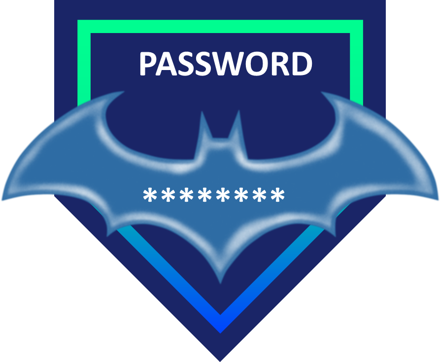
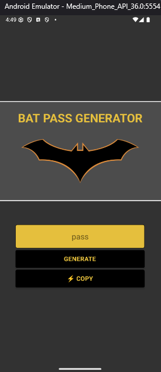

<div align="center">
  <a href="#">
      
  </a>

## Preview

<div align="center">
  <a href="#">
      
  </a>
</div>

## 🔥 Features
- [x] Generate a random Strong Password;
- [x] Copy Pass to Clipboard;

## Technologies

This project was developed with the following technologies:

-   [React Native](https://reactnative.dev/)
-   [Expo](https://docs.expo.dev/)


## Building

You'll need [Node.js](https://nodejs.org) installed on your computer in order to build this app.

```bash
git clone https://github.com/felipeAguiarCode/react-native-bat-pass-generator.git
$ cd react-native-bat-pass-generator
$ npm install
$ npm run start
```

## Usage

🔧 Run the script

```bash
$ npm run start
```

Runs the app in the development mode.<br/>

## Autor

| [<br><sub>Pedro Henrique</sub>](https://github.com/felipeAguiarCode) |
| :---------------------------------------------------------------------------------------------------------------------------------------: |
|                                             [Linkedin](https://www.linkedin.com/in/pedro-henrique-marques-rocha-dev/)                                             |
